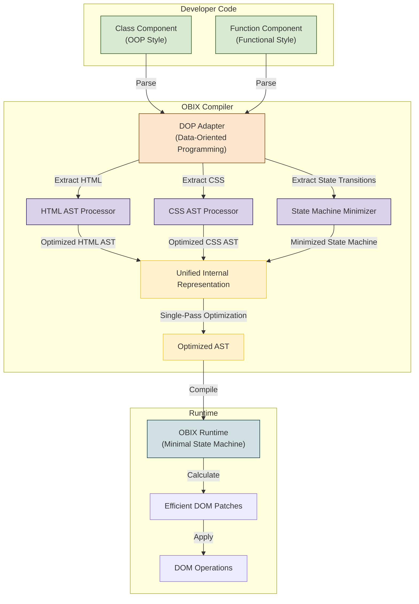

```mermaid
flowchart TD
    subgraph "Developer Code"
        classComponent["Class Component\n(OOP Style)"]
        functionComponent["Function Component\n(Functional Style)"]
    end
    
    subgraph "OBIX Compiler"
        dopAdapter["DOP Adapter\n(Data-Oriented Programming)"]
        
        htmlProcessor["HTML AST Processor"]
        cssProcessor["CSS AST Processor"]
        stateMachine["State Machine Minimizer"]
        
        unifiedModel["Unified Internal Representation"]
        
        optimizedAST["Optimized AST"]
    end
    
    subgraph "Runtime"
        optimizedRuntime["OBIX Runtime\n(Minimal State Machine)"]
        domPatches["Efficient DOM Patches"]
        domOperations["DOM Operations"]
    end
    
    classComponent -->|Parse| dopAdapter
    functionComponent -->|Parse| dopAdapter
    
    dopAdapter -->|Extract HTML| htmlProcessor
    dopAdapter -->|Extract CSS| cssProcessor
    dopAdapter -->|Extract State Transitions| stateMachine
    
    htmlProcessor -->|Optimized HTML AST| unifiedModel
    cssProcessor -->|Optimized CSS AST| unifiedModel
    stateMachine -->|Minimized State Machine| unifiedModel
    
    unifiedModel -->|Single-Pass Optimization| optimizedAST
    
    optimizedAST -->|Compile| optimizedRuntime
    
    optimizedRuntime -->|Calculate| domPatches
    domPatches -->|Apply| domOperations
    
    style classComponent fill:#d9ead3,stroke:#274e13
    style functionComponent fill:#d9ead3,stroke:#274e13
    style dopAdapter fill:#fce5cd,stroke:#783f04
    style unifiedModel fill:#fff2cc,stroke:#f1c232
    style optimizedAST fill:#fff2cc,stroke:#f1c232
    style optimizedRuntime fill:#d0e0e3,stroke:#0c343d
    style htmlProcessor fill:#d9d2e9,stroke:#20124d
    style cssProcessor fill:#d9d2e9,stroke:#20124d
    style stateMachine fill:#d9d2e9,stroke:#20124d
```