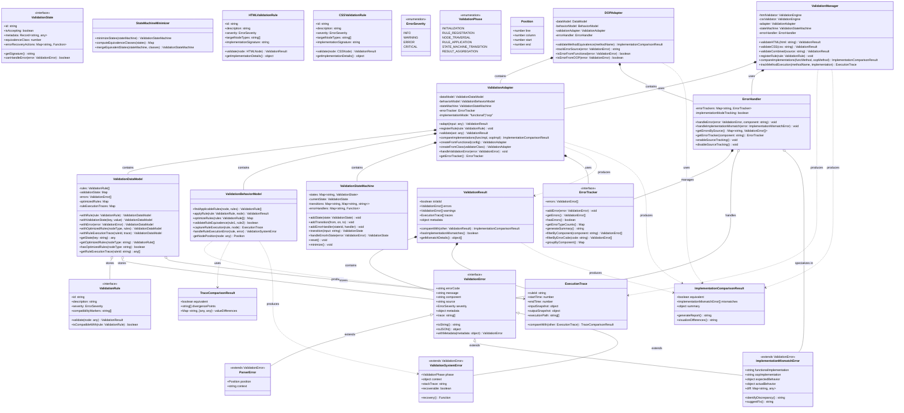

```mermaid
classDiagram
    %% Core Error Interfaces
    class ValidationError {
        <<interface>>
        +string errorCode
        +string message
        +string component
        +string source
        +ErrorSeverity severity
        +object metadata
        +trace: string[]
        +toString() string
        +toJSON() object
        +withMetadata(metadata: object) ValidationError
    }
    
    class ImplementationMismatchError {
        <<extends ValidationError>>
        +string functionalImplementation
        +string oopImplementation
        +object expectedBehavior
        +object actualBehavior
        +diff: Map~string, any~
        +identifyDiscrepancy() string
        +suggestFix() string
    }
    
    class ValidationSystemError {
        <<extends ValidationError>>
        +ValidationPhase phase
        +object context
        +stackTrace: string
        +recoverable: boolean
        +recovery() Function
    }
    
    class ErrorTracker {
        <<interface>>
        +errors: ValidationError[]
        +addError(error: ValidationError) void
        +getErrors() ValidationError[]
        +hasErrors() boolean
        +getErrorTypeCounts() Map
        +generateSummary() string
        +filterByComponent(component: string) ValidationError[]
        +filterByErrorCode(code: string) ValidationError[]
        +groupByComponent() Map
    }
    
    class ParserError {
        <<extends ValidationError>>
        +Position position
        +string context
    }
    
    %% DOP Adapter Components with Enhanced Error Handling
    class ValidationAdapter {
        -dataModel: ValidationDataModel
        -behaviorModel: ValidationBehaviorModel
        -stateMachine: ValidationStateMachine
        -errorTracker: ErrorTracker
        -implementationMode: "functional"|"oop"
        +adapt(input: any) ValidationResult
        +registerRule(rule: ValidationRule) void
        +validate(ast: any) ValidationResult
        +compareImplementations(funcImpl, oopImpl) ImplementationComparisonResult
        +createFromFunctional(config) ValidationAdapter
        +createFromClass(validatorClass) ValidationAdapter
        +handleValidationError(error: ValidationError) void
        +getErrorTracker() ErrorTracker
    }
    
    class ValidationDataModel {
        -rules: ValidationRule[]
        -validationState: Map
        -errors: ValidationError[]
        -optimizedRules: Map
        -ruleExecutionTraces: Map
        +withRule(rule: ValidationRule) ValidationDataModel
        +withValidationState(key, value) ValidationDataModel
        +withError(error: ValidationError) ValidationDataModel
        +withOptimizedRules(nodeType, rules) ValidationDataModel
        +withRuleExecutionTrace(ruleId, trace) ValidationDataModel
        +getState(key: string) any
        +getOptimizedRules(nodeType: string) ValidationRule[]
        +hasOptimizedRules(nodeType: string) boolean
        +getRuleExecutionTrace(ruleId: string) any[]
    }
    
    class ValidationBehaviorModel {
        +findApplicableRules(node, rules) ValidationRule[]
        +applyRule(rule: ValidationRule, node) ValidationResult
        +optimizeRules(rules: ValidationRule[]) Map
        +validateRuleEquivalence(rule1, rule2) boolean
        +captureRuleExecution(rule, node) ExecutionTrace
        -handleRuleExecutionError(rule, error) ValidationSystemError
        -getNodePosition(node: any) Position
    }
    
    %% Implementation Comparison
    class ImplementationComparisonResult {
        +boolean equivalent
        +ImplementationMismatchError[] mismatches
        +object summary
        +generateReport() string
        +visualizeDifferences() string
    }
    
    class ExecutionTrace {
        +ruleId: string
        +startTime: number
        +endTime: number
        +inputSnapshot: object
        +outputSnapshot: object
        +executionPath: string[]
        +compareWith(other: ExecutionTrace) TraceComparisonResult
    }
    
    class TraceComparisonResult {
        +boolean equivalent
        +string[] divergencePoints
        +Map~string, [any, any]~ valueDifferences
    }
    
    %% State Machine Components
    class ValidationStateMachine {
        -states: Map~string, ValidationState~
        -currentState: ValidationState
        -transitions: Map~string, Map~string, string~~
        -errorHandlers: Map~string, Function~
        +addState(state: ValidationState) void
        +addTransition(from, on, to) void
        +addErrorHandler(stateId, handler) void
        +transition(input: string) ValidationState
        +handleErrorInState(error: ValidationError) ValidationState
        +reset() void
        +minimize() void
    }
    
    class ValidationState {
        <<interface>>
        +id: string
        +isAccepting: boolean
        +metadata: Record~string, any~
        +equivalenceClass: number
        +errorRecoveryActions: Map~string, Function~
        +getSignature() string
        +canHandleError(error: ValidationError) boolean
    }
    
    class StateMachineMinimizer {
        +minimizeStates(stateMachine) ValidationStateMachine
        +computeEquivalenceClasses(states) Map
        +mergeEquivalentStates(stateMachine, classes) ValidationStateMachine
    }
    
    %% Validation Components
    class ValidationRule {
        <<interface>>
        +id: string
        +description: string
        +severity: ErrorSeverity
        +compatibilityMarkers: string[]
        +validate(node: any) ValidationResult
        +isCompatibleWith(rule: ValidationRule) boolean
    }
    
    class HTMLValidationRule {
        +id: string
        +description: string
        +severity: ErrorSeverity
        +targetNodeTypes: string[]
        +implementationSignature: string
        +validate(node: HTMLNode) ValidationResult
        +getImplementationDetails() object
    }
    
    class CSSValidationRule {
        +id: string
        +description: string
        +severity: ErrorSeverity
        +targetNodeTypes: string[]
        +implementationSignature: string
        +validate(node: CSSNode) ValidationResult
        +getImplementationDetails() object
    }
    
    class ValidationResult {
        +boolean isValid
        +ValidationError[] errors
        +ValidationError[] warnings
        +ExecutionTrace[] traces
        +object metadata
        +compareWith(other: ValidationResult) ImplementationComparisonResult
        +hasImplementationMismatches() boolean
        +getMismatchDetails() object[]
    }
    
    %% Error Type Definitions
    class ErrorSeverity {
        <<enumeration>>
        INFO
        WARNING
        ERROR
        CRITICAL
    }
    
    class ValidationPhase {
        <<enumeration>>
        INITIALIZATION
        RULE_REGISTRATION
        NODE_TRAVERSAL
        RULE_APPLICATION
        STATE_MACHINE_TRANSITION
        RESULT_AGGREGATION
    }
    
    class Position {
        +number line
        +number column
        +number start
        +number end
    }
    
    %% Component Integration
    class DOPAdapter {
        -dataModel: DataModel
        -behaviorModel: BehaviorModel
        -validationAdapter: ValidationAdapter
        -errorHandler: ErrorHandler
        +validateMethodEquivalence(methodName) ImplementationComparisonResult
        +trackErrorSource(error: ValidationError) string
        +isErrorFromFunctional(error: ValidationError) boolean
        +isErrorFromOOP(error: ValidationError) boolean
    }
    
    class ErrorHandler {
        -errorTrackers: Map~string, ErrorTracker~
        -implementationModeTracking: boolean
        +handleError(error: ValidationError, component: string) void
        +handleImplementationMismatch(error: ImplementationMismatchError) void
        +getErrorsBySource() Map~string, ValidationError[]~
        +getErrorTracker(component: string) ErrorTracker
        +enableSourceTracking() void
        +disableSourceTracking() void
    }
    
    %% Validation Management
    class ValidationManager {
        -htmlValidator: ValidationEngine
        -cssValidator: ValidationEngine
        -adapter: ValidationAdapter
        -stateMachine: ValidationStateMachine
        -errorHandler: ErrorHandler
        +validateHTML(html: string) ValidationResult
        +validateCSS(css: string) ValidationResult
        +validateCombined(source: string) ValidationResult
        +registerRule(rule: ValidationRule) void
        +compareImplementations(funcMethod, oopMethod) ImplementationComparisonResult
        +trackMethodExecution(methodName, implementation) ExecutionTrace
    }
    
    %% Relationships
    ValidationError <|-- ParserError : extends
    ValidationError <|-- ImplementationMismatchError : extends
    ValidationError <|-- ValidationSystemError : extends
    
    ValidationAdapter *-- ValidationDataModel : contains
    ValidationAdapter *-- ValidationBehaviorModel : contains
    ValidationAdapter *-- ValidationStateMachine : contains
    ValidationAdapter *-- ErrorTracker : uses
    ValidationAdapter ..> ValidationResult : produces
    ValidationAdapter ..> ImplementationComparisonResult : produces
    
    ValidationBehaviorModel ..> ExecutionTrace : produces
    ValidationBehaviorModel ..> TraceComparisonResult : uses
    ValidationBehaviorModel ..> ValidationSystemError : produces
    
    ValidationDataModel o-- ValidationRule : stores
    ValidationDataModel o-- ValidationError : stores
    ValidationDataModel o-- ExecutionTrace : stores
    
    ValidationResult *-- ValidationError : contains
    ValidationResult *-- ExecutionTrace : contains
    ValidationResult ..> ImplementationComparisonResult : produces
    
    DOPAdapter *-- ValidationAdapter : contains
    DOPAdapter *-- ErrorHandler : contains
    DOPAdapter ..> ImplementationComparisonResult : uses
    
    ErrorHandler *-- ErrorTracker : manages
    ErrorHandler o-- ValidationError : handles
    ErrorHandler o-- ImplementationMismatchError : specializes in
    
    ValidationManager *-- ValidationAdapter : uses
    ValidationManager *-- ErrorHandler : uses
    ValidationManager ..> ExecutionTrace : produces
    ValidationManager ..> ImplementationComparisonResult : produces
```