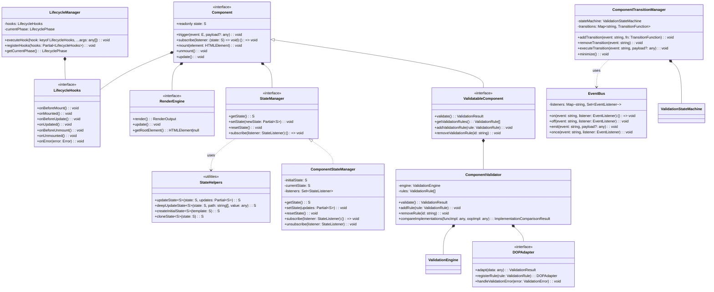

```mermaid
classDiagram
    %% Core Interfaces
    class Component {
        <<interface>>
        +readonly state: S
        +trigger(event: E, payload?: any): void
        +subscribe(listener: (state: S) => void): () => void
        +mount(element: HTMLElement): void
        +unmount(): void
        +update(): void
    }
    
    class LifecycleHooks {
        <<interface>>
        +onBeforeMount(): void
        +onMounted(): void
        +onBeforeUpdate(): void
        +onUpdated(): void
        +onBeforeUnmount(): void
        +onUnmounted(): void
        +onError(error: Error): void
    }
    
    class StateManager {
        <<interface>>
        +getState(): S
        +setState(newState: Partial~S~): void
        +resetState(): void
        +subscribe(listener: StateListener): () => void
    }
    
    class RenderEngine {
        <<interface>>
        +render(): RenderOutput
        +update(): void
        +getRootElement(): HTMLElement|null
    }
    
    %% Validation Interfaces
    class ValidatableComponent {
        <<interface>>
        +validate(): ValidationResult
        +getValidationRules(): ValidationRule[]
        +addValidationRule(rule: ValidationRule): void
        +removeValidationRule(id: string): void
    }
    
    class DOPAdapter {
        <<interface>>
        +adapt(data: any): ValidationResult
        +registerRule(rule: ValidationRule): DOPAdapter
        +handleValidationError(error: ValidationError): void
    }
    
    %% Implementation Classes
    class ComponentTransitionManager {
        -stateMachine: ValidationStateMachine
        -transitions: Map~string, TransitionFunction~
        +addTransition(event: string, fn: TransitionFunction): void
        +removeTransition(event: string): void
        +executeTransition(event: string, payload?: any): void
        +minimize(): void
    }
    
    class ComponentStateManager {
        -initialState: S
        -currentState: S
        -listeners: Set~StateListener~
        +getState(): S
        +setState(updates: Partial~S~): void
        +resetState(): void
        +subscribe(listener: StateListener): () => void
        +unsubscribe(listener: StateListener): void
    }
    
    class LifecycleManager {
        -hooks: LifecycleHooks
        -currentPhase: LifecyclePhase
        +executeHook(hook: keyof LifecycleHooks, ...args: any[]): void
        +registerHooks(hooks: Partial~LifecycleHooks~): void
        +getCurrentPhase(): LifecyclePhase
    }
    
    class ComponentValidator {
        -engine: ValidationEngine
        -rules: ValidationRule[]
        +validate(): ValidationResult
        +addRule(rule: ValidationRule): void
        +removeRule(id: string): void
        +compareImplementations(funcImpl: any, oopImpl: any): ImplementationComparisonResult
    }
    
    %% Utility Classes
    class StateHelpers {
        <<utilities>>
        +updateState~S~(state: S, updates: Partial~S~): S
        +deepUpdateState~S~(state: S, path: string[], value: any): S
        +createInitialState~S~(template: S): S
        +cloneState~S~(state: S): S
    }
    
    class EventBus {
        -listeners: Map~string, Set~EventListener~~
        +on(event: string, listener: EventListener): () => void
        +off(event: string, listener: EventListener): void
        +emit(event: string, payload?: any): void
        +once(event: string, listener: EventListener): void
    }
    
    %% Relationships
    Component <|-- ValidatableComponent
    Component *-- StateManager
    Component *-- RenderEngine
    Component *-- LifecycleHooks
    
    ValidatableComponent *-- ComponentValidator
    ComponentValidator *-- DOPAdapter
    
    StateManager <|.. ComponentStateManager
    StateManager ..> StateHelpers : uses
    
    ComponentTransitionManager *-- ValidationStateMachine
    ComponentTransitionManager ..> EventBus : uses
    
    LifecycleManager *-- LifecycleHooks
    
    ComponentValidator *-- ValidationEngine
```